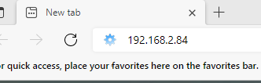
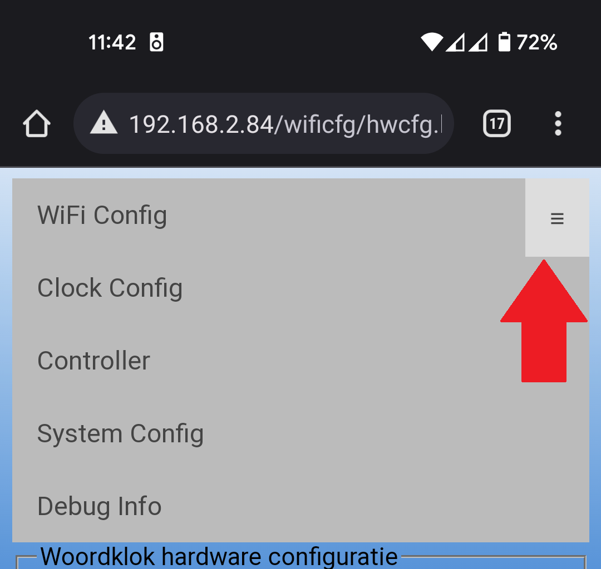

# Installatie handleiding
Deze handleiding zal stapsgewijs uitleggen hoe u de klok kunt installeren en gebruiken. Het laatste hoofdstuk zal veel gestelde vragen beantwoorden.
## Installatie 
De klok haalt zijn tijd op vanaf het internet, Dit kan de klok alleen doen zodra de klok verbind met uw WiFi thuis. Nadat de klok met uw WiFi is verbonden zal de klok altijd de goede tijd weergeven.
### Stap 1:
- Sluit de USB aan op een USB adapter van minimaal 1A, 
- Sluit de andere kant aan op de controller van de klok

- Uw klok zal opstarten en de onderstaande tekst zal over het scherm scrollen\
 `No WiFi Connect to woordklok WiFi and sign in`

### Stap 2 
- Open op uw telefoon/Laptop/tablet de WiFi instellingen
- Zoek naar de Wifi met de naam `woordklokxxxxxx` (de x maakt uw klok uniek) \

- Verbind met de `woordklok` WiFi
- Klik op de Pop-up om in te loggen(de meeste telefoons doen dit automatisch):\

- Als alles goed is gegaan ziet u nu deze pagina: \

- Indien u de Pop-up niet krijgt zoals bij sommige Samsung telefoons. 
- drukt u lang op de woordklokxxxxxx wifi en daarna op router beheer zoals: \

### Stap 3
- Selecteer uw WiFi Thuis door op de `Select` te klikken
- Voer het wachtwoord in van uw Thuis netwerk
- klik op Save om de instelling te bevestigen
- De klok zal herstarten en verbinding maken met uw Thuisnetwerk

## Gebruik
De Klok is nu verbonden met uw Thuis netwerk en kan de tijd van het internet halen. Maar nu wil u de kleur aanpassen of hoe de klok animeert.
### Stap 1
- Weet u het IP adres al? ga naar Stap 2
- Herstart de klok door de voeding 5 seconde los te halen
- Neem wat afstand van de klok om de cijfers goed te kunnen lezen
- Schrijf de cijfers op die langs gelopen komen: \
- Voorbeeld: 192.168.178.13 of 192.168.2.84 (meestal is alleen het laatste getal anders)
- Op deze foto ziet u het getal 168 waarvan alleen 16 momenteel in beeld is \

### Stap 2
- Pak u telefoon/laptop/tablet
- Controller dat u verbonden bent met uw Thuisnetwerk
- Open een browser (chrome, safarie, Edge, ..)
- Voer het IP adres in de adres balk en open de site \

### Stap 3
De website van de klok zal verschijnen, Linksboven kan het menu opengeklapt worden

- Clock Config
    - De kleur is de kleur van de tijd
    - Tekst effect is het effect op de tijd (random/Rainbow)
    - Helderheid van 0 tot 5 ingesteld, en is een extra offset in de helderheid
    - achtergrondkleur, is de kleur van alle letter die niet de tijd weergeven
    - animaties, is een keuze van een aantal animaties
    - Tekst, Is een aanpasbare tekst die als loopkrant langs kan komen
    - Save, hiermee wordt de nieuwe instelling actief

    
- Wifi config
    - SSID is de naam van de wifi netwerk waarmee de klok moet verbinden.
    - Password, het wachtwoord van het wifi netwerk

    
- Systeem Config
    - Hardware versie, 13x13 of 11x11 is het aantal letters in de lengte en breedte
    - Pixel type, is het type ledstrip (RGB is standaard)
    - Perfect inperfections, hiermee wordt er soms een willekeurige led aangezet
    - Hier ben ik, 
    - OTA fw server, Dit is de server waar de klok nieuwe FW kan ophalen
    
    

## Veel gestelde vragen
### Hoe vind ik de webpagina van de klok?
Herstart de klok, en lees het IP adres af vanaf een afstand, dit adres kunt u invoeren in een browser en de webpagina zal verschijnen

### Er brand altijd een rode letter in de hoek?
Uw klok kan momenteel geen verbinding maken met het internet, Probeer de klok te herstarten indien daarmee het probleem niet is verhopen is misschien uw WiFi veranderd volg de installatie stappen

### Hoe pas ik de kleur van de letter aan?
De kleur van de klok kan aangepast worden via de website. De website is via het IP adres van de klok beschikbaar

### Ik kan het IP adres niet lezen?
Neem wat afstand van de klok zodat u duidelijker cijfers zult zien.
De klok maakt "misbruik" van het matrix concept van de bediening van de woord aansturing, het IP adres komt als loopkrant langs

### Mijn Thuis Wifi staat niet in de lijst en nu?
Door op de `refresh` knop te klikken zal de klok opnieuw opzoek gaan naar WiFi netwerken in de buurt.
De klok verijst een 2.4GhZ WiFi netwerk, 5Ghz wordt niet ondersteund, vaak kunt u dit instellen op uw thuis netwerk.

### Mijn klok doet gek, de letters staan niet goed of de wo0rden kloppen niet?
Gezien de klok in twee maten verkocht worden kan het zijn dat de systeem instellingen van de klok niet meer goed staan, Dit kun u herstellen door:

### Mijn klok is kapot en nu?
Neem contact op zolang u vriendelijk blijft is er een hoop mogelijk.

