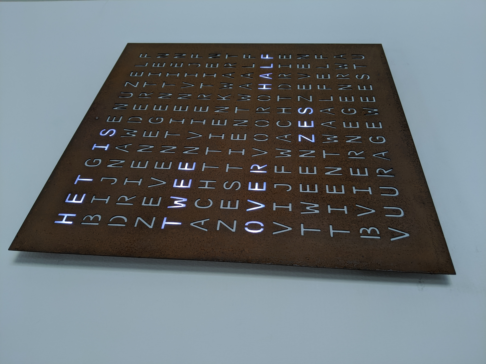
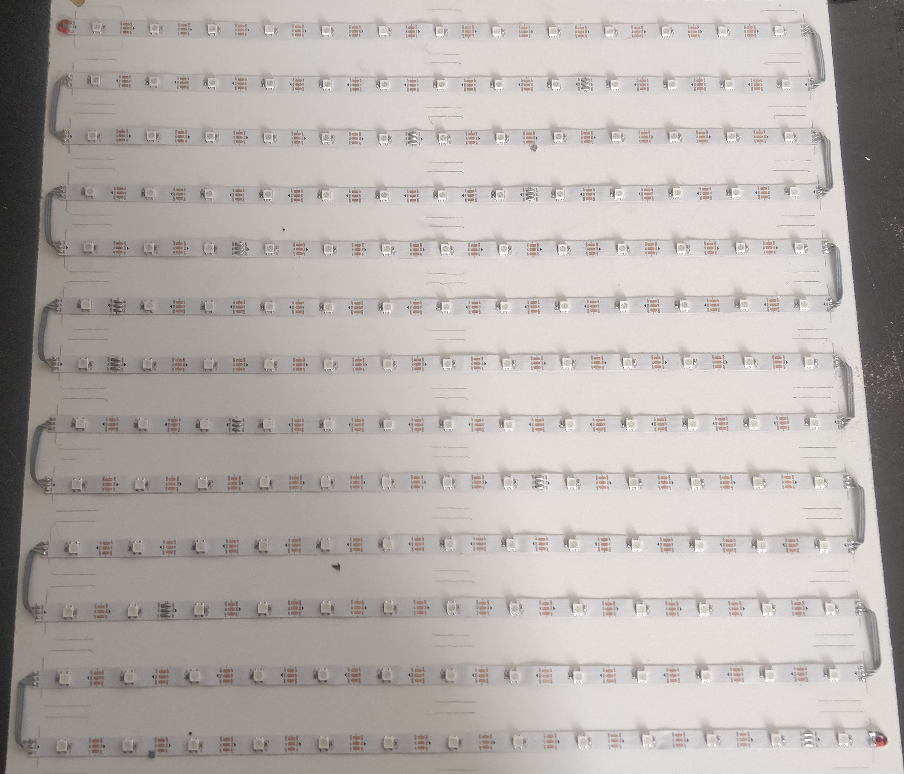

# Parts
## Electronics:
- NodeMcu Lolin V3 ESP32 [Link](https://www.ebay.com/itm/NodeMCU-V3-ESP8266-ESP-12-E-Lua-CH340-WiFI-WLan-IoT-Lolin-Mini-N3A2-V9T3/312753940110)
- Led strip: WS2812B [Link](https://www.ebay.com/itm/1-5m-WS2812B-RGB-Led-Strip-Light-30-60-144Leds-m-Individual-Addressable-IC-DC5V/401755047203?var=671534865138)
- LDR: 5MM GL5537 [Link](https://www.ebay.com/itm/20pcs-Photoresistor-5MM-GL5537-LDR-Photo-Resistors-Light-Dependent-Resistor/381374819080?epid=1381908731&hash=item58cbb5eb08:g:INIAAOxyYSdTAJq4)
- 100kOhm Resistor [link](https://www.ebay.com/itm/100PCS-1-4W-0-25W-Metal-Film-Resistor-1-Full-Range-of-Values-0-to-10M/252838503547?hash=item3ade59647b:m:m9AAPzkedx9P_upvXOpgF9Q) 
- flat cable
- Power wire
- micro USB
- USB A
## Shop / Bouwmarkt:
- For frames clock:
    - Ikea RIBBA frame 23cm [link](https://www.ikea.com/nl/nl/p/ribba-fotolijst-zwart-40378401/)
    - Ikea RIBBA frame 50cm [link](https://www.ikea.com/nl/nl/p/ribba-fotolijst-zwart-00378436/)
- Multiplex timmerplaat gegrond 3 mm 122x61
- MDF 122x61cm 12/15mm
- Hoekprofiel aluminium 12x12/15x15 mm 2 meter
- Bison 2-componentenlijm kombi metaal 24 ml
- Plaatschroef 3x13 mm cilinderkop
## Special:
- letterplate
    - laser cutting: €50.0/€150.0
- led-divider cnc: (time)

# Electronic Wiring
- ESP(Rx) -> Led Strip (Data)
- ESP(GND) -> Led Strip (GND)
- ESP(VU) -> Led Strip (5v)
- LDR(1) -> ESP(GND)
- LDR(2) -> ESP(A0)
- ESP(A0) -> RESISTOR(100kOhm) -> ESP(3v)

- 

# Build Types
The wordclock can be created in 2 sizes because of the used led strip. Its 60 LED's per meter or 30 LED's per meter.
## Normal (Desk size)
- 60 Leds per meter
    - 11x11 letters => 121 LED's => (2.01m) => 3 meter ledstrip
- 12mm MDF plate 23*23 cm
- Hardboard 23*23 cm
### Frame (ikea RIBBA) 

### Frameless

## Big clock (wall size)
The Big clock can be created with 11x11 letters or 13x13 letters
- 30 Leds per meter
    - 11x11 letters => 121 LED's => (4.04m) => 5 meter ledstrip
    - 13x13 letters => 169 LED's => (5.7m) => 6 meter ledstrip
- MDF plate 50*50 cm
- Hardboard 50*50 cm

### Frame 11x11 letters

### Frame 13x13 letters

### Frameless 13x13 letters

# Assemble
The assembly can be divided into the following parts:
- led-panel
- light-divider
- letterplate
- Electronics
## light-divider
### CNC light-divider

### light-divider by hand
For the famed Clock the MDF plate need's to be 23x23 or 50x50 cm. For the frameless the MDF plate can be LxB 21x20 or 45,5x47 but start with 23x23 or 50x50.
The Normal clock can be made with 9mm or 12mm MDF plate.
The big clock can be made with 12mm or 15mm MDF plate.
- Determine the center of the plate by drawing 2 lines
- From the center draw a grid of lines
    - For the 60 led's per meter -> distance between lines is 1.6666 cm
    - For the 30 led's per meter -> distance between lines is 3.3333 cm
- 
- Drill a hole through each line crossing
    - Use a speed drill or a countersink bit
    - For the normal clock the hole is 12mm
    - For the big clock the hole is 30mm
- For the frameless clock the bottom, right and left side can be shorted so the letterplate will floating from the wall
    - The top side is used to hang the clock
- The result should look like the cnc light-divider

## led-panel
- Place the led-panel under the light-divider.
- Trace the first, middle and last holes from the light-divider on the led panel
- Trace the outer line from the light-divider
    - in case of the frameless the top can be shorten 2 cm
- Cut peace’s from the ledstrip, (cut on the line that is drawn on the 3 copper paths)
    - For the 11x11 clock the ledstrip should be 11 leds long 
    - For the 13x13 clock the ledstrip should be 13 leds long 
- Place the led-strips with the led centred on the traces on the hardboard by following the this pattern:
    - Start upper left with Din and place it to the upper Right side end with Dout
    - The second row start with Dout on the left side and ends with Din
    - continue this zigzag pattern until all rows are done
- Use a Flat cable to connect the ledstrips from Dout to Din.
    - Cut flat cable, strip and tin both ends, cut the both ends so they are separated from each other
    - pre-solder both ends of the ledstrip
    - Start upper right with Dout solder all 3 pins(GND, Dout, 5V) Fold the flat cable 90 degrees down, fold it 90 degrees towards Din Solder again
- drill a hole next to the first led, and next to the last led
- Connect power supply from the first led to the last led with the red/black wire
- Connect the powers supply and the Din with the ESP (see Electronic Wiring)
- 
- You should be able to test the LED panel by connection the ESP to its power supply

## Connect the led-panel with the light-divider
- Place the light-divider on the led-panel and make sure all leds are centred
- Drill (1.5mm) hole through both panels. These hols can later be used to connect both panels
- Flip it and screw both panels to each other.
- Frameless ESP placement
    - Big clock place the ESP in the upper right corner (hot glue)
    - Normal clock the ESP will be screwed to the back
- 

## Diffuser (to be improved)
- place the paper over the light-divider and cut it on size
- make sure its stays in place with tape

## Letterplate
### frame
- Connect the LDR and the resistor (see Electronic Wiring)
- fix the ESP with a screw to the back of the led-panel
- Place the letterplate and the light divider in the frame
- place some foam in the back so all is pushed forwarded
- Close the frame
### frameless
- Center the light-divider on the letterplate and drill the LDR hole
- Draw the outer line from the light-divider
- Cut the aluminium strip so it fits nicely around the light-divider (left, right and bottom)
- Make both the letterplate and the aluminium strip rough with sanding paper
- drill 3 holes in all aluminium strips (used for connecting the letterplate to the light-divider)
- glue the aluminium strip on the letterplate (use glue clamps) wait 24 hours
- screw the letterplate to the light-divider
- 

# Hardware Drawings
## letterplate
- I Have created a FreeCAD pyhton macro for generating a Letterplate, ..\hardware\lettering_plates\FreeCAD_drawings\freecad_macro
- The letterplate is parametric so can be used for 11*11 of 13*13
- After the generation is done, export the part as .STEP (the DXF generator from freecad is not smooth)
- FreeCAD export DXF WORKS (0.18.4):
    - Edit -> Preference -> Inport-Export -> DXF
    - Max Spline Segment to 0,1 or 0,01 mm (NOTE use , instead of .)
    - Select all elements
    - File -> Export -> Autodesk DXF 2d
- Import the .STEP file into Fusion for creating the DXF file of gcode
- G-code
    - Create A body by setting the Hight
    - Switch to manufacture
    - start creating the Gcode
- DXF:
    - Create a sketch on the Top view
    - Menu -> Create -> Project / include -> include 3D Geometry
    - Select the Body from the letterplate
    - Save Sketch -> right klik the Sketch and save as DXF
## ledschotten
- The LDR for the 11*11 clock is 214.444 mm from the bottom (This information is printed by FreeCAD)
- The LDR for the 13*13 clock is 477.778 mm from the bottom
- The LEDschotten is completely drawn in Fusion360, and is partly parametric.

# Tips & tricks:
- The MDF plate can also be replaced by "Foamed pvc"

# Note:
The NodeMcu Lolin V3 is needed because the Lolin has a 3v reference voltage for its adc that is used for the LDR all other NodeMC have 1v reference voltage

